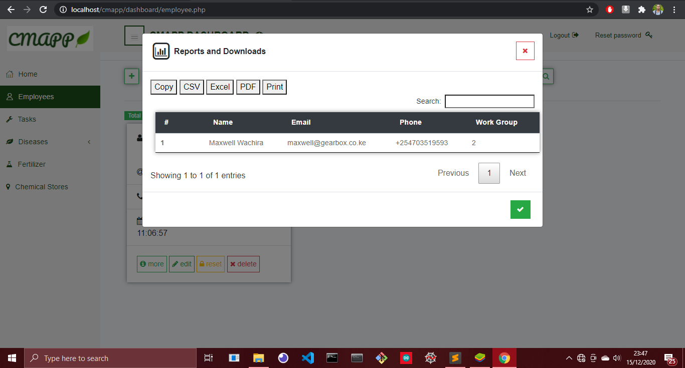

# cmapp

This is the home page/landing page.  
This is the about page
This is the login page. http://139.59.142.183/cmapp/auth/login.php              
This is the signup page. http://139.59.142.183/cmapp/signup.php                
This is the contact page. http://139.59.142.183/cmapp/contact.php       
This is a screenshot showing the information that is send to our email (cmappdsail@gmail.com) from the contact page         
This is the forgot password page. http://139.59.142.183/cmapp/auth/forgot_password.php            
This is a screenshot showing the reset password link sent to the manager's email address for password recovery        
The image below shows the password reset form        
This is the dashboard landing page. It has a summary of the total number of employees as well as the total number of tasks. http://139.59.142.183/cmapp/dashboard/index.php        
This is the add employee page. The manager can add, read, update and delete employees. http://139.59.142.183/cmapp/dashboard/employee.php              
The image below is a screenshot showing how farm employees are notified via email when the farm manager creates an account for them. The email contains the the login credentials        
The image below shows the employees report download. The manager can download the employees details in the form of csv, pdf or excel. The manager can also directly print the employees details              
This is the task page. The manager can add, read, update and delete tasks as well as assign the tasks to existing employees (Employees that the manager has added to the system). . http://139.59.142.183/cmapp/dashboard/tasks.php              
The image below is a screenshot showing how farm employees are notified via email when the farm manager assigns tasks to them . The email contains the a summary of the task.         
The image below shows the tasks report download. The manager can download the task details in the form of csv, pdf or excel. The manager can also directly print the task details              
The image below show the disease page. It contains the agronomics behind some common causes of diseases. http://139.59.142.183/cmapp/dashboard/common_diseases.php              
The image below shows how to prevent the diseases in the previous image. http://139.59.142.183/cmapp/dashboard/disease_management.php              
The image below show the fertilizer calculator. Input the size of the farm, age of the coffee trees and select the nutrient you want and it doeas the magic for you. http://139.59.142.183/cmapp/dashboard/fertilizer.php        
The image shows calculated fertilizer amount and the corresponding cost             
The image below show a map of chemical stores where the farm manager can purchase farm inputs. http://139.59.142.183/cmapp/dashboard/chemical_stores.php        
